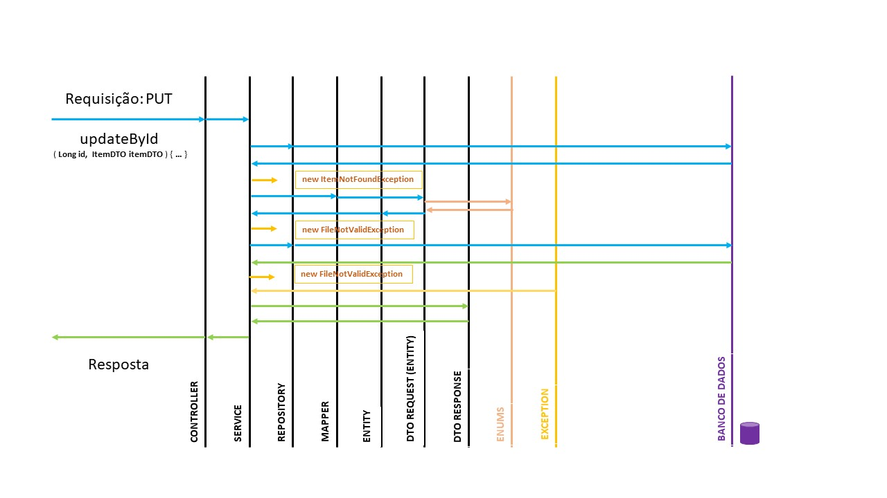

### [TURING]-Projeto-Java-Accenture
Projeto de conclusão de Curso - Parte JAVA

---
**Enunciado:** Os grupos deverão desenvolver um sistema que permita o Cadastro, Inclusão, Consulta e Exclusão de Alunos.

### Critérios de avaliação:

Orientação a Objetos, Modelagem e Banco de Dados e Persistência.

---
**Os alunos deverão ser cadastrados com os seguintes campos mínimos:**

1. Chave de relacionamento
2. Nome
3. Endereço com cidade, UF e CEP.
4. Telefone
5. Nota da Prova1
6. Nota da Prova2
7. Nota do Trabalho
8. Nota da Apresentação
9. Curso
10. Disciplina
11. Conceito

---
### Lógica de programação

Realizar alguma funcionalidade que envolva regra de negócio com ênfase no cadastro de alunos como tratamento de campos obrigatórios, cálculo da média final, aprovação e reprovação.

### Spring e Spring WEB

Criar APIs Rest documentada com Swagger utilizando o Spring Web para realizar todas as operações de cadastro de alunos.

Deverão ser apresentados os recursos utilizados no desenvolvimento como Linguagens, Gerenciador de Banco de Dados, Tecnologias (Spring, Swing, CSS,  etc).

Como iremos falar de Spring  e APIs, o uso do Swing (opcional) poderia ser um cliente da API utilizando Rest Controller ou OpenFeint.

&nbsp;

---

&nbsp;

# PROPOSTA DE SOLUÇÃO & AGRADECIMENTOS

O cliente que poderá acessar pelo link: [FRONT-END](https://github.com/grenoldi/turing-students).
E a aplicação [BACK-END](https://github.com/Jeffrs123/TURING-Projeto-Java-Accenture).

O grupo se dividiu em duas partes, o que ocasionou a separação da proporção de soluções, uma equipe para implementar o Back e a outra o Front.

Nossos Maiores aprendizados foram o de que quando um, ou no caso mais que um, membro da equipe deixa de fazer parte da mesma, o prazo para propor solução se estende e sobrecarrega nossos colegas.

Então nosso muito obrigado pela oportunidade de aprendermos e crescermos mais.

&nbsp;

---

&nbsp;

# END POINTS E MÉTODOS SUPORTADOS

## ALUNOS

### **`POST ALUNO - Criar aluno`**

api/v1/alunos/

&nbsp;

### **`GET ALUNOS - Listar alunos`** 

api/v1/alunos

&nbsp;

### **`GET ALUNOS BY REQ.PARAMS NOME - Listar alunos por para do nome ou nome completo`**
Com req params que suporta pesquisa pelo atributo **`nome`**, sendo passado como o nome inteiro ou em parte do nome, podendo ser o começo, meio ou final. Ex.:

api/v1/alunos?nome=Jefferson

api/v1/alunos?nome=Jef

api/v1/alunos?nome=son

api/v1/alunos?nome=ff

&nbsp;

### **`PUT ALUNO BY ID - Atualizar aluno pelo ID`**

api/v1/alunos/{id}

&nbsp;

### **`DELETE ALUNO - Deletar aluno`**

api/v1/alunos/{id}

&nbsp;

### **`GET ALUNO BY ID`**

api/v1/alunos/{id}

&nbsp;

## ALUNOS/{ID}/NOTAS

&nbsp;

### **`POST - Insetir nova nota para o Aluno`**

api/v1/alunos/{id}/notas

&nbsp;

### **`GET - Listar as notas do Aluno`**

api/v1/alunos/{id}/notas

&nbsp;

### **`PUT - Atualizar nota do Aluno`**
api/v1/alunos/{id}/notas /{notaId}

&nbsp;

---

&nbsp;

# CAMADAS

## Controller

> Camada de contato da aplicação Back-End para com algum cliente.

* Receber Requisições.
* Enviar Respostas. 
* Definidas as API's da aplicação.

&nbsp;

## Service

> Camada lógica que faz interação para atingir o objetivo da requisição (seja pegar uma lista de dados ou algum dado em específico, como criar, atualizar e/ou deletar)

* Lógica para atingir o objetivo;
* Conecções com todas as demais camadas da aplicação, inclusive uma service conversar com outra service, de acordo com a necessidade lógica.
* 

&nbsp;

## Repository

> Interface para implementar métodos genéricos e próprios para cada entidade, como no caso de filtrar aluno pelo nome.

* Métodos de CRUD geral como: create, update, save.
* E para implementar métodos próprios e uso de anotações para query específicas, se fizer parte da lógica da solução proposta.

&nbsp;

## Mapper

> Interface que gera a transpilação dos dados conforme o cliente (front-end) envia as suas requisições para o formato de como a aplicação processa e efetua sua lógica de negócio. E vice-versa.

* 

&nbsp;

## Entity

> Geramos as classes das entidades, com formatos que serão processados de forma interna. 
* Como por exemplo informar que o cpf é do tipo Long e fazer as suas devidas tratativas, assim, como também informar ao Banco de Dados que esse valor não poderá ser igual.

&nbsp;

## Dto Request (Entity)

> Camada que define como os dados serão recebidos e enviados para o cliente após processamento interno.

* Como o exemplo do cpf, que recebemos em String e a enviamos também assim.
* ou o caso do status da nota que no banco de dados é salvo com os valores de 0, 1 ou 2 e para o cliente é enviado com as informações: APROVADO, REPROVADO e/ou RECUPERACAO.

&nbsp;

## Dto Response

> Camada que definimos o formato de respostas, podendo ser criada Respostas em Strings, ou formatos próprios que desejamos que o cliente o receba, como inserção de links (o que não foi o alvo da proposta em questão).

&nbsp;

## Enums

> Camada para definir de valores imutáveis e que façam partes da lógica de negócio.

* Exemplo: StatusAprovacao -> APROVADO, REPROVADO e/ou RECUPERACAO.

&nbsp;

## Exception

> Camada para criarmos e definir Exceptions que façam parte da lógica da aplicação.

* Exemplo: FiledNotValidException -> para informar que caso tente ser alterado algum aluno e o id no corpo da mensagem ser diferente, não prosseguir com a operação.

* Exemplo: ItemNotFoundException -> para informar que o recurso que está sendo requisitado ou para leitura (GET), alteração (PUT) ou deleção (DELETE) é inválido porque o recurso não existe na aplicação.

&nbsp;

## Banco de Dados

&nbsp;

# ESTRUTURA DO FLUXO DE DADOS

## Fluxo da Informação no método Update.

Aqui vemos que o fluxo pelo qual as camadas se comunicam.

No exemplo abaixo vemos o método PUT que é o de atuzaliar, que é o dos poucos métodos que poderá ter conexão com todas as camadas.

&nbsp;

Modelo do Banco de dados projetado.

