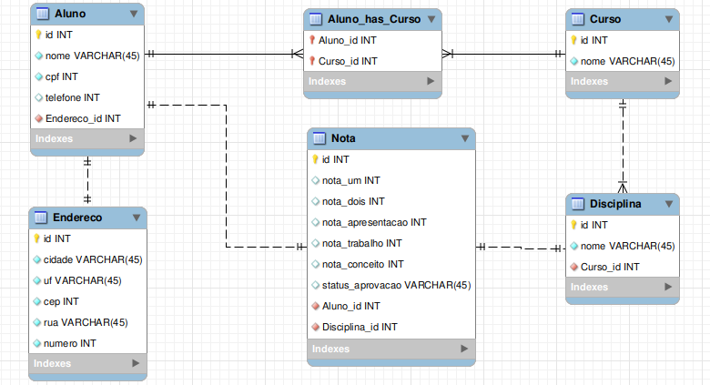

### [TURING]-Projeto-Java-Accenture
Projeto de conclusão de Curso - Parte JAVA

---
**Enunciado:** Os grupos deverão desenvolver um sistema que permita o Cadastro, Inclusão, Consulta e Exclusão de Alunos.

### Critérios de avaliação:

Orientação a Objetos, Modelagem e Banco de Dados e Persistência.

---
**Os alunos deverão ser cadastrados com os seguintes campos mínimos:**

1. Chave de relacionamento
2. Nome
3. Endereço com cidade, UF e CEP.
4. Telefone
5. Nota da Prova1
6. Nota da Prova2
7. Nota do Trabalho
8. Nota da Apresentação
9. Curso
10. Disciplina
11. Conceito

---
### Lógica de programação

Realizar alguma funcionalidade que envolva regra de negócio com ênfase no cadastro de alunos como tratamento de campos obrigatórios, cálculo da média final, aprovação e reprovação.

### Spring e Spring WEB

Criar APIs Rest documentada com Swagger utilizando o Spring Web para realizar todas as operações de cadastro de alunos.

Deverão ser apresentados os recursos utilizados no desenvolvimento como Linguagens, Gerenciador de Banco de Dados, Tecnologias (Spring, Swing, CSS,  etc).

Como iremos falar de Spring  e APIs, o uso do Swing (opcional) poderia ser um cliente da API utilizando Rest Controller ou OpenFeint.

# CAMADAS

## Controller

> Camada de contato da aplicação Back-End para com algum cliente.

* Receber Requisições.
* Enviar Respostas. 
* Definidas as API's da aplicação.

&nbsp;

## Service

> Camada lógica que faz interação para atingir o objetivo da requisição (seja pegar uma lista de dados ou algum dado em específico, como criar, atualizar e/ou deletar)

* Lógica para atingir o objetivo;
* Conecções com todas as demais camadas da aplicação, inclusive uma service conversar com outra service, de acordo com a necessidade lógica.
* 

&nbsp;

## Repository

> 

* 

&nbsp;

## Mapper

> 

* 

&nbsp;

## Entity

> 

* 

&nbsp;

## Dto Request (Entity)

> 

* 

&nbsp;

## Dto Response

> 

* 

&nbsp;

## Enums

> 

* 

&nbsp;

## Exception

> 

* 

&nbsp;

## Banco de Dados

&nbsp;

# ESTRUTURA DO FLUXO DE DADOS

## Fluxo da Informação no método Update.

Aqui vemos que o fluxo de dados passa por todas as camadas de nossa aplicação.

